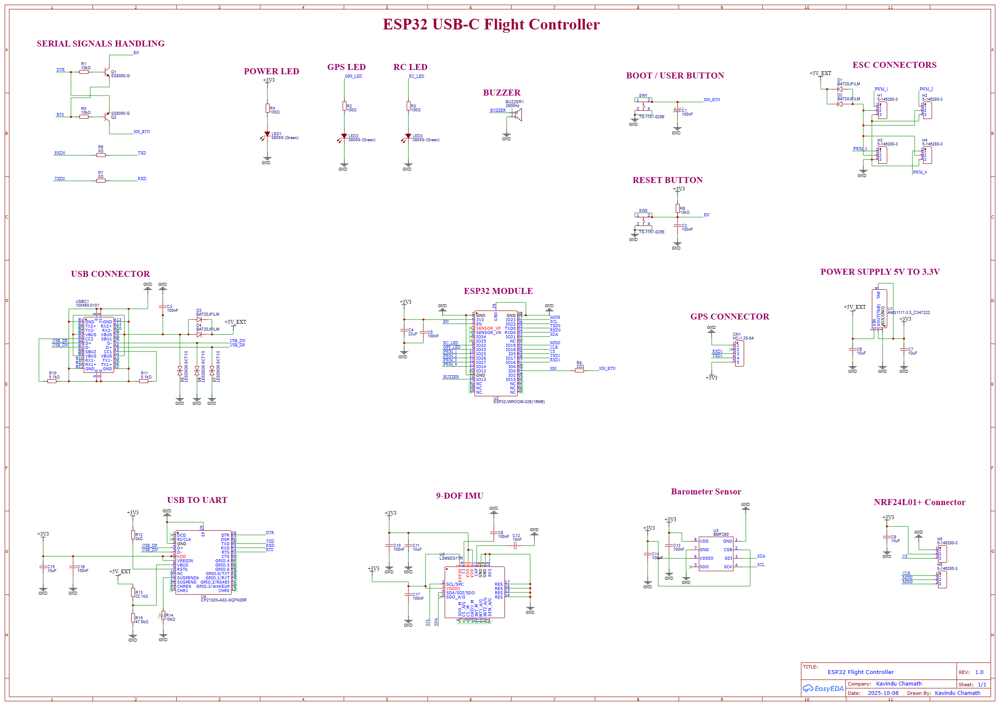

# 🛩️ ESP32 USB-C Flight Controller

## 📘 Overview
This project is a **custom-designed flight controller board** based on the **ESP32-WROOM-32 module**.  
It integrates essential sensors, communication modules, and power management suitable for drones and robotics applications.  
Designed using **EasyEDA**, the board supports development using both **Arduino** and **ESP-IDF** frameworks.

---

## ⚙️ Key Features
- **Microcontroller:** ESP32-WROOM-32 (dual-core, Wi-Fi + Bluetooth)
- **USB-C Interface:** Integrated USB Type-C for power and programming
- **USB-to-UART Bridge:** CP2102 / CH340 serial interface
- **Sensors:**
  - **9-DOF IMU** (accelerometer, gyroscope, magnetometer)
  - **Barometer Sensor** for altitude measurement
- **Wireless Communication:** NRF24L01+ module connector for RC or telemetry
- **GPS Interface:** Dedicated UART port for GPS modules
- **ESC Outputs:** 4 PWM outputs for motor ESCs
- **User Interface:**
  - BOOT / USER button and RESET button
  - Power, GPS, and RC activity LEDs
  - Piezo buzzer for audible feedback
- **Power System:**
  - 5V input via USB-C or external source
  - On-board 3.3V regulator for logic and sensors

---

## 🧩 Circuit Blocks
| Section | Description |
|----------|-------------|
| **ESP32 Module** | Main MCU controlling logic, sensors, and communication |
| **USB Connector** | USB-C port for power and serial link |
| **USB to UART** | Serial bridge for programming/debugging |
| **Power Supply (5V → 3.3V)** | Stable 3.3V regulation |
| **9-DOF IMU** | Motion and orientation sensing |
| **Barometer Sensor** | Air pressure and altitude measurement |
| **GPS Connector** | UART interface for GPS modules |
| **ESC Connectors** | 4 PWM channels for motor control |
| **NRF24L01+ Connector** | Optional wireless link module |
| **LEDs, Buttons, Buzzer** | Indicators and control feedback |

---

## 🧰 Tools & Environment
- **Design Software:** EasyEDA  
- **Firmware Development:** Arduino IDE / ESP-IDF  
- **Microcontroller:** ESP32-WROOM-32  

---

## 🖼️ Hardware Design Images

### 📜 Schematic

### 🧠 PCB Previews
| Top View | Bottom View |
|-----------|--------------|
|  |  |

---

## 📦 Gerber Files
You can download the Gerber files for PCB manufacturing here:  
👉 [Gerber_ESP32-Flight-Controller-V1_PCB_ESP32-Flight-Controller-V1_2025-10-30.zip](Gerber_ESP32-Flight-Controller-V1_PCB_ESP32-Flight-Controller-V1_2025-10-30.zip)

---

## 🧑‍💻 Author
**Kavindu Chamath**  
Designed and tested using EasyEDA  
Date: *2025-10-30*

---

## 🪪 License
This project is released under the **MIT License**.  
You are free to use, modify, and distribute this design with proper credit.

---

## ⭐ Contributing
Pull requests, feature suggestions, and improvements are always welcome!  
Feel free to fork this repository and make it your own version of the ESP32 Flight Controller.
